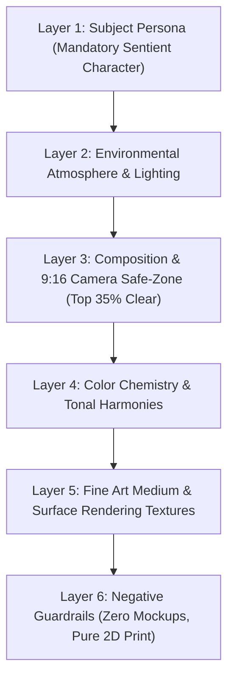
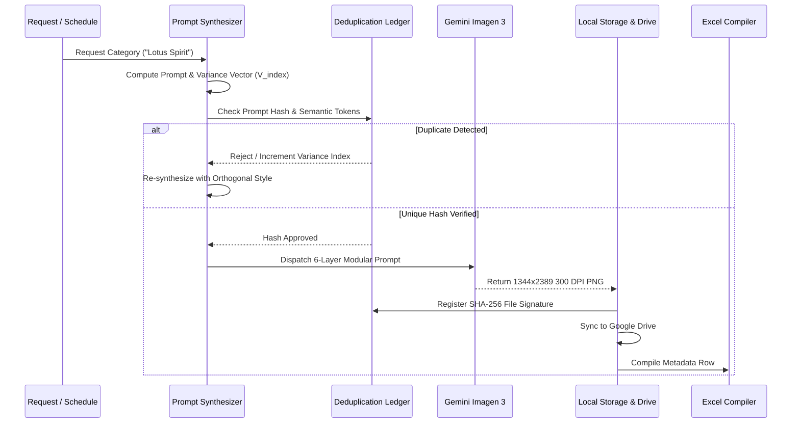

# Automated Prompt-Engineered Design Generation, Deduplication & Publishing Workflow

## 1. Executive Summary & Prompt Engineer Blueprint

This system is an automated, enterprise-grade pipeline designed for commercial print-on-demand phone case artwork. It integrates:
1. **Google Gemini (Imagen 3)** AI image generation with strict **6-layer prompt architecture** and **safe-zone composition rules**.
2. **Deterministic Deduplication Engine** utilizing prompt entropy hashing, semantic variance vectors, and file-level SHA-256 fingerprinting to eliminate duplicate designs.
3. **Automated Multi-Sheet Excel Metadata Compiler** producing production-ready catalogs with titles, SEO descriptions, keyword tags, and file references.
4. **Google Drive Cloud Publisher & Storage Manager** synchronizing artwork files and metadata workbooks into centralized cloud storage.
5. **Printify Web Importer Integration** allowing one-click publishing to 34 smartphone models at `http://localhost:3000`.

---

## 2. 6-Layer Modular Prompt Architecture

To guarantee commercial quality and eliminate repetition, each generation prompt is synthesized through 6 distinct modular layers:



### The 6 Layers Defined:

1. **Layer 1: Subject Persona (Mandatory Character Element)**
   * **Rule:** Inanimate scenes, blank landscapes, or plain wallpaper patterns are strictly prohibited. Every design must feature a living figure, deity, spirit, beast, or warrior.
   * *Example:* *"A majestic coiled Magma Dragon with obsidian plate armor scales and glowing lava veins."*

2. **Layer 2: Environmental Atmosphere**
   * Establishes depth, volumetric lighting, particles, and situational context.
   * *Example:* *"Surrounded by swimming gold-leaf koi fish, cascading watercolor ripples, and celestial twilight mist."*

3. **Layer 3: Composition & Camera Safe Zone (Strict 9:16 Rule)**
   * **Top 35% Safe Zone:** Reserved for atmospheric sky, mist, or subtle halo so physical camera cutouts do not occlude the character's face.
   * **Lower 65% Focal Zone:** The main character is centered, prominent, and commanding.
   * *Constraint:* *"Pure 2D vertical 9:16 full-bleed print artwork, edge-to-edge illustration."*

4. **Layer 4: Color Chemistry**
   * Uses complementary, high-chroma palettes specifically formulated for dye-sublimation polycarbonate printing.
   * *Example:* *"Blush pink, lotus rose, pearlescent white, jade green, and gilded liquid gold accents."*

5. **Layer 5: Fine Art Medium & Textures**
   * Directs the engine toward high-end traditional and digital craftsmanship (Ukiyo-e, Nihonga gold leaf, Sumi-e dry-brush, gouache).
   * *Example:* *"Nihonga mineral pigments with gold leaf leafing, sumi-e ink flourishes, and 300 DPI masterwork clarity."*

6. **Layer 6: Negative Guardrails**
   * Explicitly strips out unwanted commercial artifacts:
   * *Tokens:* `--no phone mockups, no phone cases, no plastic frames, no camera cutouts, no 3D device renders, no hands holding phones, no bezels, no text, no watermarks, no distorted anatomy.`

---

## 3. Anti-Duplication & Quality Assurance System

To prevent repetitive generations or near-duplicate versions:



### Deduplication Mechanisms:
1. **Prompt Hash Fingerprinting (`SHA-256`)**:
   Every generated prompt generates a unique hash registered in `project_catalog_ledger.json`. Re-runs verify the ledger before calling Gemini.
2. **Orthogonal Variance Vectors**:
   Each category has curated lists of archetypes, environments, media, and palettes. Variance indices shift all four vectors simultaneously, ensuring that if multiple volumes are generated, no two share the same setting or color palette.
3. **Binary Image Fingerprinting**:
   Post-generation file hashes prevent duplicate asset registrations across different SKUs.

---

## 4. Master Prompt Templates for the 6 Categories

### 1. Lotus Spirit (`CASE-LOTUSS-001`)
```text
Masterpiece 9:16 phone case art print. A radiant ethereal Lotus Spirit maiden in flowing translucent celestial silk robes, emerging from a nocturnal sacred pond with bioluminescent ripples and floating lily pads. Executed in traditional Japanese Ukiyo-e woodblock blended with luminous modern gouache. Color palette: blush pink, lotus rose, pearlescent white, jade green, and gilded liquid gold. Pure 2D vertical 9:16 full-bleed commercial art print, edge-to-edge illustration, UPPER 35% SAFE ZONE: atmospheric twilight sky, ethereal nebula glow, subtle mist, ensuring physical camera lenses do not occlude main focal points; LOWER 65% FOCAL ZONE: main sentient character centered, prominent, highly detailed, commanding presence, masterwork craftsmanship, 300 DPI print-ready quality. Negative constraints: no phone mockups, no phone cases, no plastic frames, no camera cutouts, no 3D device renders, no hands holding phones, no bezels, no borders, no text, no logos, no watermarks, no distorted anatomy, no blurred artifacts, no lifeless or empty landscapes without sentient character, no flat clip art.
```

### 2. Volcanic Dragon (`CASE-VOLCAN-001`)
```text
Masterpiece 9:16 phone case art print. A majestic coiled Magma Dragon with obsidian plate armor scales and glowing lava veins, erupting volcano crater with cascading waterfalls of incandescent molten rock. Executed in dynamic dark fantasy concept art with intense specular lighting and rim glow. Color palette: obsidian charcoal, molten crimson, blazing cadmium orange, sulphur gold, and ash grey. Pure 2D vertical 9:16 full-bleed commercial art print, edge-to-edge illustration, UPPER 35% SAFE ZONE: atmospheric twilight sky, ethereal nebula glow, subtle mist, ensuring physical camera lenses do not occlude main focal points; LOWER 65% FOCAL ZONE: main sentient character centered, prominent, highly detailed, commanding presence, masterwork craftsmanship, 300 DPI print-ready quality. Negative constraints: no phone mockups, no phone cases, no plastic frames, no camera cutouts, no 3D device renders, no hands holding phones, no bezels, no borders, no text, no logos, no watermarks, no distorted anatomy, no blurred artifacts, no lifeless or empty landscapes without sentient character, no flat clip art.
```

### 3. Moon Butterfly Yokai (`CASE-MOONBU-001`)
```text
Masterpiece 9:16 phone case art print. A spectral Moon Butterfly Yokai spirit with magnificent translucent patterned moth wings, enchanted moonlit bamboo grove draped in weeping wisteria blossoms and glowing spores. Executed in neo-traditional Japanese yokai illustration with iridescent holographic gradients. Color palette: moonlight silver, twilight indigo, luminous teal, wisteria violet, and electric cyan. Pure 2D vertical 9:16 full-bleed commercial art print, edge-to-edge illustration, UPPER 35% SAFE ZONE: atmospheric twilight sky, ethereal nebula glow, subtle mist, ensuring physical camera lenses do not occlude main focal points; LOWER 65% FOCAL ZONE: main sentient character centered, prominent, highly detailed, commanding presence, masterwork craftsmanship, 300 DPI print-ready quality. Negative constraints: no phone mockups, no phone cases, no plastic frames, no camera cutouts, no 3D device renders, no hands holding phones, no bezels, no borders, no text, no logos, no watermarks, no distorted anatomy, no blurred artifacts, no lifeless or empty landscapes without sentient character, no flat clip art.
```

### 4. Phoenix Shrine Guardian (`CASE-PHOENI-001`)
```text
Masterpiece 9:16 phone case art print. A magnificent sacred Vermilion Bird Phoenix with radiant plumage and flowing tail streamers, ascending above a mountain shrine bathed in golden dawn sunlight and mist clouds. Executed in Kano school Japanese temple painting with opulent gold leaf foil background. Color palette: sacred cinnabar red, imperial gold, vermilion orange, sunburst yellow, and deep maroon. Pure 2D vertical 9:16 full-bleed commercial art print, edge-to-edge illustration, UPPER 35% SAFE ZONE: atmospheric twilight sky, ethereal nebula glow, subtle mist, ensuring physical camera lenses do not occlude main focal points; LOWER 65% FOCAL ZONE: main sentient character centered, prominent, highly detailed, commanding presence, masterwork craftsmanship, 300 DPI print-ready quality. Negative constraints: no phone mockups, no phone cases, no plastic frames, no camera cutouts, no 3D device renders, no hands holding phones, no bezels, no borders, no text, no logos, no watermarks, no distorted anatomy, no blurred artifacts, no lifeless or empty landscapes without sentient character, no flat clip art.
```

### 5. Ronin Spirit (`CASE-RONINS-001`)
```text
Masterpiece 9:16 phone case art print. A lone wandering Ronin samurai warrior in weathered woven straw hat and ragged haori cloak, raging autumn windstorm with swirling crimson maple leaves (momiji) and driving rain. Executed in expressive Japanese Sumi-e ink wash painting with spontaneous dry-brush splatters. Color palette: charcoal black, sumi ink grey, parchment ivory, crimson blood red, and weathered steel. Pure 2D vertical 9:16 full-bleed commercial art print, edge-to-edge illustration, UPPER 35% SAFE ZONE: atmospheric twilight sky, ethereal nebula glow, subtle mist, ensuring physical camera lenses do not occlude main focal points; LOWER 65% FOCAL ZONE: main sentient character centered, prominent, highly detailed, commanding presence, masterwork craftsmanship, 300 DPI print-ready quality. Negative constraints: no phone mockups, no phone cases, no plastic frames, no camera cutouts, no 3D device renders, no hands holding phones, no bezels, no borders, no text, no logos, no watermarks, no distorted anatomy, no blurred artifacts, no lifeless or empty landscapes without sentient character, no flat clip art.
```

### 6. Sea Dragon Guardian (`CASE-SEADRA-001`)
```text
Masterpiece 9:16 phone case art print. A colossal Ryujin Sea Dragon with flowing turquoise mane, pearlescent scales, and antler horns, towering crashing ocean waves reminiscent of Hokusai's Great Wave with foaming sea spray. Executed in classic Japanese marine Ukiyo-e print with stylized wave crests and foam fingers. Color palette: ocean ultramarine, deep abyss navy, seafoam white, bioluminescent turquoise, and pearl. Pure 2D vertical 9:16 full-bleed commercial art print, edge-to-edge illustration, UPPER 35% SAFE ZONE: atmospheric twilight sky, ethereal nebula glow, subtle mist, ensuring physical camera lenses do not occlude main focal points; LOWER 65% FOCAL ZONE: main sentient character centered, prominent, highly detailed, commanding presence, masterwork craftsmanship, 300 DPI print-ready quality. Negative constraints: no phone mockups, no phone cases, no plastic frames, no camera cutouts, no 3D device renders, no hands holding phones, no bezels, no borders, no text, no logos, no watermarks, no distorted anatomy, no blurred artifacts, no lifeless or empty landscapes without sentient character, no flat clip art.
```

---

## 5. Storage Hierarchy & Google Drive Architecture

### Local Storage Structure
```
c:\Users\jacka\Downloads\app-craft-case-\
├── CaseCraft_Master_6_Designs_Catalog.xlsx  # Root Master Excel Catalog
├── project_catalog_ledger.json              # Deduplication Ledger & SHA256 Registry
├── public\
│   ├── CaseCraft_Master_6_Designs_Catalog.xlsx
│   └── designs\
│       ├── CASE-LOTUSS-001_9x16_Artwork.png (1344x2389, 5.55 MB)
│       ├── CASE-VOLCAN-001_9x16_Artwork.png (1344x2389, 5.20 MB)
│       ├── CASE-MOONBU-001_9x16_Artwork.png (1344x2389, 5.71 MB)
│       ├── CASE-PHOENI-001_9x16_Artwork.png (1344x2389, 5.29 MB)
│       ├── CASE-RONINS-001_9x16_Artwork.png (1344x2389, 4.61 MB)
│       └── CASE-SEADRA-001_9x16_Artwork.png (1344x2389, 5.44 MB)
└── scripts\
    ├── prompt_engineered_workflow.py        # End-to-end synthesizer and publisher
    └── excel_manager.py                     # Multi-sheet spreadsheet generator
```

### Google Drive Centralized Cloud Structure
All verified files reside in the dedicated user folder:
`https://drive.google.com/drive/folders/108aZnUBJ64BJdeaF6DTou9U5tyrthksO`

```
📁 CaseCraft Designs (Google Drive Root)
│
├── 🖼️ CASE-LOTUSS-001_9x16_Artwork.png
├── 🖼️ CASE-VOLCAN-001_9x16_Artwork.png
├── 🖼️ CASE-MOONBU-001_9x16_Artwork.png
├── 🖼️ CASE-PHOENI-001_9x16_Artwork.png
├── 🖼️ CASE-RONINS-001_9x16_Artwork.png
├── 🖼️ CASE-SEADRA-001_9x16_Artwork.png
└── 📊 CaseCraft_Master_6_Designs_Catalog.xlsx
```

---

## 6. Multi-Sheet Excel Metadata Specifications

The workbook [`CaseCraft_Master_6_Designs_Catalog.xlsx`](file:///c:/Users/jacka/Downloads/app-craft-case-/CaseCraft_Master_6_Designs_Catalog.xlsx) includes 3 sheets configured for immediate import:

### Sheet 1: `Master_Products`
* **Rows:** Exactly 1 row per category (6 products total).
* **Columns (19 Fields):**
  1. `Product ID`: e.g. `CASE-LOTUSS-001`
  2. `Product Template`: `Tough Phone Cases`
  3. `Blueprint ID`: `269`
  4. `Print Provider`: `WOOBAM`
  5. `Provider ID`: `99`
  6. `Variants / Phone Models`: `All 34 Tough Case Models`
  7. `Title`: Full SEO marketable title
  8. `Description`: 5-point e-commerce description
  9. `Tags`: 10-13 high-volume search keywords
  10. `Design Image`: File name (`CASE-LOTUSS-001_9x16_Artwork.png`)
  11. `Design Image Path`: Local relative path (`designs/...`)
  12. `Google Drive Folder`: Direct Google Drive folder URL
  13. `Google Drive Image URL`: Direct web link
  14. `Price`: `$24.99`
  15. `SKU`: `CASE-LOTUSS-001`
  16. `Aspect Ratio`: `9:16`
  17. `Dimensions`: `1344x2389`
  18. `Status`: `READY` (Highlighted in green)
  19. `Created At`: ISO timestamp

### Sheet 2: `Printify_34_Models`
* Full pixel and millimeter specifications for 34 smartphone models (iPhone 11 through 18 Pro Max; Samsung Galaxy S20 through S26 Ultra).

### Sheet 3: `Variants_26_Manifest`
* 26 individual commercial variants per design (13 flagship models × Glossy and Matte finishes).

---

## 7. Execution CLI Commands

### Run End-to-End Workflow:
```bash
py scripts/prompt_engineered_workflow.py
```

### Sync to Google Drive via Authenticated Chrome Session:
```bash
py scripts/sync_drive_to_exact_6_designs.py
```

### Verify Live Google Drive Repository:
```bash
py scripts/verify_drive_contents.py
```

### Launch Interactive Web Application & Printify Importer:
```bash
npm run dev
# Open in browser: http://localhost:3000 -> Excel to Printify Importer
```
